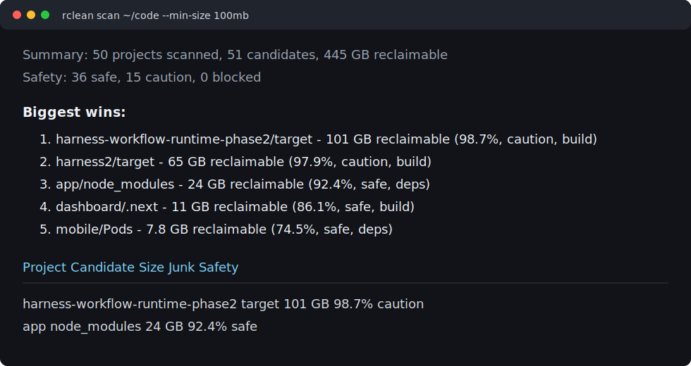

# rclean

[](https://github.com/majiayu000/rclean/actions/workflows/ci.yml)
[](https://github.com/majiayu000/rclean/actions/workflows/audit.yml)

Rust-native CLI for finding and cleaning rebuildable developer artifacts.

`rclean` is not a general disk cleaner. It targets project-local artifacts
that can be recreated from source, lockfiles, package managers, or build tools:
`node_modules`, `.next`, `.venv`, `target`, Python caches, Turborepo/Vite caches,
and similar directories.

The trust model is the product: scan first, explain every candidate, write an
ActionPlan when you want a reviewable cleanup, and never select blocked paths.

Real local benchmark:

```text
50 projects scanned
51 candidates
445 GB reclaimable above 100 MB
largest candidate: harness-workflow-runtime-phase2/target at 101 GB
```



## Current Status

This is a from-scratch Rust CLI. It already supports:

- `scan` with human table output
- "Biggest wins" scan summary with project artifact percentage
- `scan --json`
- `clean --dry-run`
- `clean --all --permanent --yes`
- `explain <path>`
- built-in rule listing (`rules`)
- per-machine diagnostic (`doctor`)
- Node, Python, Rust, Go, CocoaPods, and generic coverage rules
- Java/Gradle, Flutter/Dart, .NET, Ruby, and iOS rules
- **global toolchain caches**: Cargo registry, Go module/build
  cache, npm `_cacache` and transient caches, pnpm store, yarn cache,
  pip cache, uv cache, Poetry cache, pipx cache, Bun install cache,
  Deno cache, Bundler compact index, Kubernetes/gcloud caches, Gradle
  caches, Maven local repo, Puppeteer Chrome, HuggingFace Hub,
  PyTorch Hub, Ollama models (report-only), VS Code/Cursor caches,
  obsolete editor extensions, Claude Code old versions, Xcode
  `DerivedData`, iOS Simulators (via `scan --home`)
- conservative safety classification: `safe`, `caution`, `blocked`, `report-only`
- root-project scanning
- symlink blocking
- dirty git worktree caution
- ActionPlan write/read
- numbered interactive selection
- `agent doctor codex` for local Codex process, disk, power, and update diagnostics
- `agent optimize codex --disable-auto-update` as a dry-run-first one-shot setting helper

## Why rclean

Existing tools already clean `node_modules`, `target`, and other artifacts.
`rclean` focuses on the part that makes people hesitate before deleting:

- clear safety states: `safe`, `caution`, `blocked`, `report-only` (user data, never selected)
- immediate top cleanup wins before the detailed table
- reviewable ActionPlan JSON
- symlink and root-boundary revalidation before plan-based cleanup
- dirty git worktrees marked as caution
- package name `rclean-cli`, installed command `rclean`

## Product Boundaries

`rclean` remains a conservative developer-cleanup tool. It is not a
general privacy cleaner, malware scanner, app uninstaller, browser-history
wipe tool, or visual disk-usage explorer. It should not grow into a broad
"make my machine clean" product by treating every large directory as a
candidate.

The safe expansion path is narrow:

- add exact-anchor rules for rebuildable developer artifacts and caches;
- keep high-cost but user-owned data, such as local model stores, as
  `report-only` unless a later workflow proves a safer deletion model;
- route destructive work through scan output, `explain`, and reviewable
  [ActionPlan](docs/action-plan-format.md) files before cleanup;
- do not add automatic `sudo`; system-scope cleanup may suggest explicit
  commands for a human to run, but `rclean` itself does not escalate.

Automatic background deletion remains out of scope. A daemon, cron job, or
"clean while idle" mode would need to be manually validated first as a normal
interactive workflow, then promoted through the same safety model instead of
starting as automation.

See the [safety model](docs/safety-model.md), the
[MVP non-goals](docs/specs/mvp-spec.md#non-goals), the
[v0.2 developer-tool boundary](docs/specs/v0.2-developer-mole.md#2-non-goals),
and the
[v0.3 whole-machine boundary](docs/specs/v0.3-developer-toolchain-extra.md)
for the detailed scope rules.

## Install

From this checkout during development:

```bash
cargo install --path .
```

After public release, the intended install path is:

```bash
cargo install rclean-cli
```

The Cargo package is `rclean-cli`; the installed command is `rclean`.

If installation or first-run behavior is confusing, use the
[feature request intake](https://github.com/majiayu000/rclean/issues/new?template=feature-request.yml)
for packaging or documentation gaps. If scan or cleanup output looks
unsafe, use the safety intake linked in [Support and Intake](#support-and-intake).

## Usage

```bash
cargo run --bin rclean -- scan ~/code
cargo run --bin rclean -- scan ~/code --json
cargo run --bin rclean -- clean ~/code --all --dry-run
cargo run --bin rclean -- clean ~/code --all --permanent --yes
cargo run --bin rclean -- explain ~/code/app/target
cargo run --bin rclean -- rules
cargo run --bin rclean -- doctor
cargo run --bin rclean -- scan --home
cargo run --bin rclean -- scan --tmp --min-size 100mb
cargo run --bin rclean -- agent doctor codex
cargo run --bin rclean -- agent optimize codex --disable-auto-update
```

### Whole-machine cleanup

`rclean scan --home` is the convenience entry point for cleaning
**every cache a developer toolchain leaves under `$HOME`** without
listing each path:

```bash
rclean doctor                                # see which global rules apply
rclean scan --home --min-size 100mb          # report candidates
rclean scan --home --write-plan plan.json    # auditable plan
rclean clean --plan plan.json --dry-run      # preview
rclean clean --plan plan.json --yes          # execute using the plan's deleteMode
```

Temporary AI-agent and review worktrees can also leave large rebuildable
artifacts under system temp roots:

```bash
rclean scan --tmp --min-size 100mb
rclean clean --tmp --all --dry-run --min-size 100mb
```

`--tmp` scans existing system temp roots such as `/tmp` and `/private/tmp`
on macOS, but cleanup still only selects candidates matched by rclean rules
and safety policy. It does not clear all of `/tmp`: safe nested artifacts
such as `target/` are selected by default, while whole temporary worktrees
are reported only for exact top-level names like `remem-*`, `rclean-*`,
`loom-*`, or `*review-target*` with a project marker and require
`--include-caution`.

On macOS, `rclean scan --system` reports only the exact system cache
anchor `/Library/Application Support/com.apple.idleassetsd`. It is
`report-only`, marked `requiresSudo`, never selected by `clean`, and
`rclean` will not run `sudo`.

`--home` expands to `~/.cargo`, `~/go`, `~/.gradle`, `~/.m2`,
`~/.npm`, `~/.pnpm-store`, `~/.bundle`, `~/.kube`,
`~/.config/gcloud`, editor extension/version roots, plus
IDE cache/log roots, `~/Library/Caches`, `~/Library/pnpm`,
`~/Library/Developer`, and
selected `~/Library/Application Support/<app>` anchors on macOS or
`~/.cache` and `~/.local/share/pnpm` on Linux. Existing
`GOPATH` entries are included too. Paths that don't exist are
filtered out silently. See the
[Global Toolchain Caches](#global-toolchain-caches) table below
for the full rule list.

After installation:

```bash
rclean scan ~/code
rclean clean ~/code --all --dry-run
```

If this quickstart flags a path that should not be cleanup, open a
[scan false positive report](https://github.com/majiayu000/rclean/issues/new?template=scan-false-positive.yml).
If the dry run or ActionPlan selection looks risky, open a
[cleanup safety concern](https://github.com/majiayu000/rclean/issues/new?template=cleanup-safety-concern.yml).

Write and review an ActionPlan:

```bash
rclean scan ~/code --write-plan rclean-plan.json
rclean clean --plan rclean-plan.json --dry-run
```

Preview stale stamped artifacts before cleanup:

```bash
rclean stamp ~/code --min-size 100mb
rclean stamp ~/code --sweep --write-plan rclean-stamp-sweep.json --min-size 100mb
rclean clean --plan rclean-stamp-sweep.json --dry-run
```

`stamp --sweep` only writes an ActionPlan for previously stamped candidates
that have not changed since they were stamped. Use `clean --plan ... --dry-run`
to review exactly what would be removed before running a real cleanup.

## Safety Model

- `scan` never deletes files.
- blocked candidates are never selected by `clean --all`.
- symlink candidates are blocked.
- generic directories like `build`, `dist`, `out`, `target`, and `vendor` require
  project marker evidence.
- Python `venv` must contain virtualenv markers.
- dirty git worktrees downgrade otherwise safe candidates to `caution`.
- `--all` selects only `safe` candidates unless `--include-caution` is passed.
- default clean mode moves to Trash when available.
- `--permanent` is required for permanent deletion.

See [`SECURITY.md`](SECURITY.md) for the threat model, in-scope issues,
and how to report a vulnerability privately.

## Support and Intake

- [Scan false positives](https://github.com/majiayu000/rclean/issues/new?template=scan-false-positive.yml):
  use when `scan` or `explain` classifies a path that should not be cleanup.
- [Cleanup safety concerns](https://github.com/majiayu000/rclean/issues/new?template=cleanup-safety-concern.yml):
  use when `clean --dry-run`, ActionPlan review, or cleanup execution looks
  risky or surprising.
- [Feature requests](https://github.com/majiayu000/rclean/issues/new?template=feature-request.yml):
  use for new ecosystem rules, install/package requests, output modes, and
  documentation gaps.

Security or private trust-model issues should follow [`SECURITY.md`](SECURITY.md)
instead of public issue intake.

## Supported Ecosystems

### Project-level artifacts

These rules fire inside a project directory (require a marker like
`Cargo.toml`, `package.json`, etc.):

| Ecosystem | Examples |
| --- | --- |
| Node/JS | `node_modules`, `.next`, `.turbo`, `.vite`, `.parcel-cache`, `dist`, `build`, `out` |
| Python | `.venv`, `venv`, `__pycache__`, `.pytest_cache`, `.mypy_cache`, `.ruff_cache`, `.tox` |
| Rust | `target` |
| Go | `vendor` |
| iOS | `Pods` |
| Java/Gradle | `target`, `build`, `.gradle` |
| Flutter/Dart | `build`, `.dart_tool` |
| .NET | `bin`, `obj` |
| Ruby | `.bundle`, `vendor/bundle` |

### Global toolchain caches

These rules fire on caches the toolchains maintain *outside*
individual projects, under `$HOME`. Use `rclean scan --home` to
let rclean find every applicable cache automatically:

| Rule id | Path | Safety | Restore |
| --- | --- | --- | --- |
| `cargo.registry_cache` | `~/.cargo/registry/cache` | safe | next `cargo build` |
| `cargo.git_db` | `~/.cargo/git/db` | safe | next `cargo build` |
| `homebrew.downloads` | `~/Library/Caches/Homebrew/downloads` (macOS) / `~/.cache/Homebrew/downloads` (Linux/XDG) | safe | next `brew install` / `brew upgrade` |
| `android_sdk.download_intermediates` | `~/Library/Android/sdk/.downloadIntermediates` (macOS) / `~/Android/Sdk/.downloadIntermediates` (Linux) / `%LOCALAPPDATA%/Android/Sdk/.downloadIntermediates` (Windows) | caution | close Android Studio/sdkmanager; downloads are recreated |
| `android_sdk.legacy_build_cache` | `~/.android/build-cache` | caution | Android Gradle Plugin rebuilds cache entries |
| `jetbrains.system_caches` | `~/Library/Caches/JetBrains/<IDE><version>/caches` (macOS) / `~/.cache/JetBrains/<IDE><version>/caches` (Linux) / `%LOCALAPPDATA%/JetBrains/<IDE><version>/caches` (Windows) | caution | close IDE; it recreates caches |
| `jetbrains.logs` | `~/Library/Logs/JetBrains/<IDE><version>` (macOS) / `~/.cache/JetBrains/<IDE><version>/log` (Linux) / `%LOCALAPPDATA%/JetBrains/<IDE><version>/log` (Windows) | caution | close IDE; it recreates logs |
| `android_studio.system_caches` | `~/Library/Caches/Google/AndroidStudio*/caches` (macOS) / `~/.cache/Google/AndroidStudio*/caches` (Linux) / `%LOCALAPPDATA%/Google/AndroidStudio*/caches` (Windows) | caution | close Android Studio; it recreates caches |
| `android_studio.logs` | `~/Library/Logs/Google/AndroidStudio*` (macOS) / `~/.cache/Google/AndroidStudio*/log` (Linux) / `%LOCALAPPDATA%/Google/AndroidStudio*/log` (Windows) | caution | close Android Studio; it recreates logs |
| `go.module_download_cache` | `~/go/pkg/mod/cache/download` / `$GOPATH/pkg/mod/cache/download` | safe | next `go build` / `go test` |
| `go.build_cache` | `~/Library/Caches/go-build` (macOS) / `~/.cache/go-build` (Linux) | safe | next `go build` / `go test` |
| `dart.pub_hosted_cache` | `~/.pub-cache/hosted` | caution | next `dart pub get` / `flutter pub get` |
| `dart.pub_git_cache` | `~/.pub-cache/git` | caution | next `dart pub get` / `flutter pub get` |
| `node.npm_cacache` | `~/.npm/_cacache` | safe | next `npm install` |
| `node.npm_transient` | `~/.npm/_npx`, `~/.npm/_logs`, `~/.npm/_prebuilds` | safe | npm recreates them as needed |
| `node.pnpm_store` | `~/.pnpm-store/vN` / `~/Library/pnpm/store` (macOS) / `~/.local/share/pnpm/store` (Linux) | safe | next `pnpm install` |
| `node.yarn_cache` | `~/Library/Caches/Yarn` (macOS) | safe | next `yarn install` |
| `pip.cache` | `~/Library/Caches/pip` (macOS) / `~/.cache/pip` (Linux) | safe | next `pip install` |
| `ruby.bundle_compact_index` | `~/.bundle/cache/compact_index` | safe | next `bundle install` |
| `cloud.kube_cache` | `~/.kube/cache` | safe | next `kubectl` use |
| `cloud.gcloud_logs` | `~/.config/gcloud/logs` | safe | gcloud recreates logs |
| `ai.huggingface_hub` | `~/.cache/huggingface/hub` | caution | `huggingface-cli delete-cache` |
| `ai.torch_hub` | `~/.cache/torch/hub` | safe | next `torch.hub.load()` |
| `ai.vllm_compile_cache` | `~/.cache/vllm/torch_compile_cache` | caution | next vLLM model/server start |
| `ai.whisper_models` | `~/.cache/whisper` | caution | next Whisper run redownloads the selected model |
| `ai.ollama_models` | `~/.ollama/models` | **report-only** (user data, never selected) | `ollama pull <model>` |
| `python.uv_cache` | `~/Library/Caches/uv` or `~/.cache/uv` (XDG override active on macOS too) | caution | `uv cache clean` |
| `python.poetry_cache` | `~/Library/Caches/pypoetry` (macOS) / `~/.cache/pypoetry` (Linux) | safe | next `poetry install` |
| `python.pipx_cache` | `~/Library/Caches/pipx` (macOS) / `~/.cache/pipx` (Linux) | safe | next `pipx run <pkg>` |
| `js.deno_cache` | `~/Library/Caches/deno` (macOS) / `~/.cache/deno` (Linux) | caution | `deno cache --reload` |
| `browser.puppeteer` | `~/Library/Caches/puppeteer` (macOS) / `~/.cache/puppeteer` (Linux) | caution | `npx puppeteer browsers install chrome` |
| `gradle.caches` | `~/.gradle/caches` | caution | next Gradle build |
| `maven.local_repo` | `~/.m2/repository` | caution | next `mvn install` |
| `xcode.derived_data` | `~/Library/Developer/Xcode/DerivedData` | safe | next Xcode build |
| `xcode.simulators` | `~/Library/Developer/CoreSimulator` | caution | next iOS app run |
| `bun.cache` | `~/.bun/install/cache` | safe | next `bun install` |
| `pre_commit.cache` | `~/.cache/pre-commit` | safe | next `pre-commit run` |
| `playwright.browsers` | `~/Library/Caches/ms-playwright` (macOS) / `~/.cache/ms-playwright` (Linux) | safe | next `npx playwright install` |
| `app.shipit_caches` | `~/Library/Caches/*.ShipIt` (macOS, Squirrel.Mac apps like VSCode/Notion) | safe | none — leftover update packages |
| `chrome.cache` | `~/Library/Caches/Google/Chrome` (macOS) | safe | next browsing |
| `chrome.google_updater` | `~/Library/Application Support/Google/GoogleUpdater` (macOS) | safe | Chrome rebuilds it on launch |
| `editor.vscode_cache` | `~/Library/Application Support/Code/{logs,Cache,CachedData,Code Cache,GPUCache}` (macOS) | caution | close VS Code; it recreates caches |
| `editor.cursor_cache` | `~/Library/Application Support/Cursor/{logs,Cache,CachedData,Code Cache,GPUCache}` (macOS) | caution | close Cursor; it recreates caches |
| `editor.vscode_obsolete_extension` | `~/.vscode/extensions/<publisher>.<name>-<old-version>` | caution | Marketplace reinstall if needed |
| `editor.cursor_obsolete_extension` | `~/.cursor/extensions/<publisher>.<name>-<old-version>` | caution | Marketplace reinstall if needed |
| `claude.old_version` | `~/.local/share/claude/versions/<old-version>` | caution | Claude Code reinstalls if needed |
| `app.electron_cache` | known macOS app support `Cache`, `Code Cache`, `GPUCache`, `Dawn*Cache` dirs | caution | close app; it recreates caches |

Run `rclean doctor` to see which of these apply on your machine
right now:

```
$ rclean doctor

Rule                       Status     Anchor / Reason
----------------------------------------------------------------------------
cargo.registry_cache       applicable ~/.cargo/registry
cargo.git_db               applicable ~/.cargo/git
go.module_download_cache   applicable ~/go/pkg/mod/cache
go.build_cache             applicable ~/Library/Caches/go-build
node.npm_cacache           applicable ~/.npm
node.pnpm_store            skipped    no pnpm store detected
pip.cache                  applicable ~/Library/Caches
python.uv_cache            applicable ~/.cache/uv
python.poetry_cache        skipped    no Poetry install detected
python.pipx_cache          skipped    no pipx install detected
js.deno_cache              skipped    no Deno install detected
node.yarn_cache            applicable ~/Library/Caches
xcode.derived_data         applicable ~/Library/Developer/Xcode
xcode.simulators           applicable ~/Library/Developer
gradle.caches              skipped    no Gradle install detected
maven.local_repo           skipped    no Maven install detected

10 of 58 rules applicable on this machine.
```

User records are not cleanup candidates. The following paths are
treated as protected user data and refused at scan, plan replay, and
delete time — even if a custom rule or tampered ActionPlan points at
them:

- `~/.codex/sessions`, `~/.codex/memories`
- `~/.claude/projects`, `~/.claude/sessions`, `~/.claude/history.jsonl`,
  `~/.claude/shell-snapshots`, `~/.claude/file-history`,
  `~/.claude/todos`

## Custom Rules (`.rclean.toml`)

Drop a `.rclean.toml` at the scan root to teach `rclean` about
project-specific artifact directories that aren't in the built-in
catalog. Each rule is a `[[rule]]` table:

```toml
[[rule]]
id = "myproj-prebuilt"
name_glob = "prebuilt"
parent_markers = ["pyproject.toml", "build.config.json"]
category = "build"
safety = "caution"
why = "regenerated by build.sh; remove to force a clean rebuild"
restore_hint = "run ./build.sh"

[[rule]]
id = "myproj-cache"
name_glob = ".myproj-cache"
parent_markers = [".myproj"]
category = "cache"
safety = "safe"
why = "myproj evaluation cache, recreated on next run"
```

Fields:

| Field | Required | Notes |
| --- | --- | --- |
| `id` | yes | Unique within the file. Duplicate ids: first wins, the rest are skipped with a warning. |
| `name_glob` | yes | `globset` glob matched against the candidate directory name (e.g. `prebuilt`, `*.cache`). |
| `parent_markers` | no | Files or directories that must exist in the candidate's parent to enable the rule. Any one marker is enough (OR). |
| `category` | yes | One of `deps`, `build`, `cache`, `test`. |
| `safety` | no | `safe` (default) or `caution`. `blocked` is rejected — only built-in rules may produce blocked. `caution` requires at least one `parent_markers` entry, so a bare-name caution rule cannot fire under arbitrary directories. |
| `why` | no | One-line reason shown in the report. Defaults to `matches user rule '<id>'`. |
| `restore_hint` | no | Short hint for `rclean explain` output. |

Invalid rules emit a `warning:` line on stderr and are dropped; the
scan continues with the remaining rules. A missing `.rclean.toml` is
the normal case and produces no warning.

User rules layer *after* built-in rules: if a directory already
matches a built-in rule (e.g. `node_modules`), the user rule never
fires for that directory.

## Examples

Scan a workspace:

```bash
rclean scan ~/code --min-size 100mb
```

Only find old dependency/build artifacts:

```bash
rclean scan ~/code --older-than 6m --category deps,build
```

Machine-readable report:

```bash
rclean scan ~/code --json > rclean-report.json
```

Preview a bulk clean:

```bash
rclean clean ~/code --all --dry-run
```

Permanent clean after reviewing the dry run:

```bash
rclean clean ~/code --all --permanent --yes
```

## Filtering

`rclean` supports several flags for narrowing what `scan` and `clean` consider.
All filters apply *after* classification, so blocked paths are still suppressed
from the bulk selection regardless of these settings.

| Flag | Default | Effect |
| --- | --- | --- |
| `--depth <N>` | `6` | Max directory levels traversed from each root. |
| `--min-size <SIZE>` | `1mb` | Drop candidates smaller than `SIZE` (e.g. `0`, `100mb`, `1g`). Blocked candidates are never dropped by size. |
| `--older-than <DUR>` | none | Keep only projects whose newest activity is older than `DUR` (e.g. `30d`, `6m`, `1y`). |
| `--category <LIST>` | all | Comma-separated subset of `deps,build,cache,test`. |
| `--rule <LIST>` | all | Comma-separated rule ids (see `rclean rules`). |
| `--include-caution` | off | Include caution candidates in `clean --all`. |
| `--include-blocked` | off | Show blocked candidates in the report. They are still never selected by `--all`. |
| `--ignore <GLOB>` | none | Repeatable. Drops candidates matching a `.gitignore`-style glob. |
| `--system` | off | macOS only. Report the exact system cache allowlist; candidates are report-only and require manual administrator cleanup. |
| `--allow-broad-root` | off | `clean` only. Allow a scan root that resolves to a broad system or user path (e.g. `/`, `$HOME`, `/etc`, `/usr`). |

## `.rcleanignore`

Place an `.rcleanignore` file at the root of any scan target to permanently
exclude candidate paths. The syntax is the same as `.gitignore`, including
negation with `!`:

```gitignore
# Keep a vendored target tree we deliberately ship
sealed-vendor/target

# Skip an entire workspace
legacy-monorepo/

# But re-include one project inside it
!legacy-monorepo/important-app/node_modules
```

`--ignore <GLOB>` layers on top of `.rcleanignore` and is repeatable, so
ad-hoc exclusions don't need a file:

```bash
rclean scan ~/code --ignore "**/playground/**" --ignore "tmp-*"
```

If both an `.rcleanignore` entry and a `--ignore` glob match the same path,
the path is excluded.

Invalid `--ignore` globs fail the scan. Invalid `.rcleanignore` files are
reported as scan warnings so the scan can continue while still marking the
result as potentially incomplete.

## Reports and Plans

`rclean scan` can emit a machine-readable JSON report or an auditable action
plan:

```bash
# JSON for tooling/CI
rclean scan ~/code --json > rclean-report.json

# Action plan for human review and replayable cleanup
rclean scan ~/code --write-plan rclean-plan.json
rclean clean --plan rclean-plan.json --dry-run
rclean clean --plan rclean-plan.json --yes
```

Scan reports include a top-level `warnings` list for recoverable scan
problems such as invalid `.rcleanignore` files or filesystem walk errors.
The table output prints the same warning summary; JSON consumers should
treat a non-empty `warnings` array as "results may be incomplete."

The action plan is the trust boundary: `clean --plan` re-validates every
path against the live filesystem before deleting, refuses to follow new
symlinks, and rejects plans whose roots have changed shape since the
scan.

## Development

```bash
cargo fmt
cargo clippy --all-targets --all-features
cargo test
cargo run --bin rclean -- scan . --json
```
